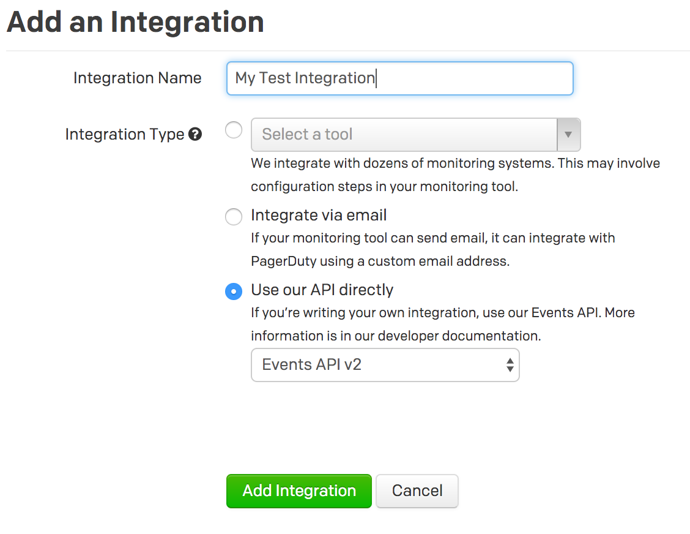
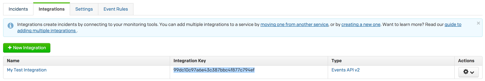

# PagerDuty Event notifications channel for Laravel 5.3

[](https://packagist.org/packages/laravel-notification-channels/pagerduty)
[](LICENSE.md)
[](https://travis-ci.org/laravel-notification-channels/pagerduty)
[](https://styleci.io/repos/:style_ci_id)
[](https://insight.sensiolabs.com/projects/:sensio_labs_id)
[](https://scrutinizer-ci.com/g/laravel-notification-channels/pagerduty)
[](https://scrutinizer-ci.com/g/laravel-notification-channels/pagerduty/?branch=master)
[](https://packagist.org/packages/laravel-notification-channels/pagerduty)

This package makes it easy to send notification events to [PagerDuty](https://www.pagerduty.com) with Laravel 5.3.

## Contents

- [Installation](#installation)
	- [Setting up the PagerDuty service](#setting-up-the-PagerDuty-service)
- [Usage](#usage)
	- [Available Message methods](#available-message-methods)
- [Changelog](#changelog)
- [Testing](#testing)
- [Security](#security)
- [Contributing](#contributing)
- [Credits](#credits)
- [License](#license)


## Installation

You can install the package via composer:

```bash
composer require laravel-notification-channels/pagerduty
```

##### TODO: Validate that the above composer package name is where this ends up.

## Usage

Now you can use the channel in your `via()` method inside the Notification class.

```php
use NotificationChannels\PagerDuty\PagerDutyChannel;
use NotificationChannels\PagerDuty\PagerDutyMessage;
use Illuminate\Notifications\Notification;

class SiteProblem extends Notification
{
    public function via($notifiable)
    {
        return [PagerDutyChannel::class];
    }

    public function toPushNotification($notifiable)
    {
        return PagerDutyMessage::create()
            ->summary('There was an error with your site in the {$notifiable->service} component.');
    }
}
```

In order to let your Notification know which Integration should receive the event, add the `routeNotificationForPagerDuty` method to your Notifiable model.

This method needs to return the Integration Key for the service and integration to which you want to send the event.

```php
public function routeNotificationForPagerDuty()
{
    return '99dc10c97a6e43c387bbc4f877c794ef';
}
```

### PagerDuty Setup
On a PagerDuty Service of your choice, create a new Integration using the `Events API v2`.



The `Integration Key` listed for your new integration is what you need to set in the `routeNotificationForPagerDuty()` method.



### Available methods

- `resolve()`: Sets the event type to `resolve` to resolve issues.
- `dedupKey('')`: Sets the `dedup_key` (required when resolving).
- `summary('')`: Sets a summary message on the event.
- `source('')`: Sets the event source; defaults to the `hostname`.
- `severity('')`: Sets the event severity; defaults to `critical`.
- `timestamp('')`: Sets the `timestamp` of the event.
- `component('')`: Sets the `component` of the event.
- `group('')`: Sets the `group` of the event.
- `setClass('')`: Sets the `class`.
- `addCustomDetail('', '')`: Adds a key/value paid to the `custom_detail` of the event.

See the [PagerDuty v2 Events API documentation](https://v2.developer.pagerduty.com/docs/send-an-event-events-api-v2)
for more information about what these options will do.

## Changelog

Please see [CHANGELOG](CHANGELOG.md) for more information what has changed recently.

## Testing

``` bash
$ composer test
```

## Security

If you discover any security related issues, please email lwaite@gmail.com instead of using the issue tracker.

## Contributing

Please see [CONTRIBUTING](CONTRIBUTING.md) for details.

## Credits

- [Luke Waite](https://github.com/lukewaite)
- [All Contributors](../../contributors)

## License

The MIT License (MIT). Please see [License File](LICENSE.md) for more information.
