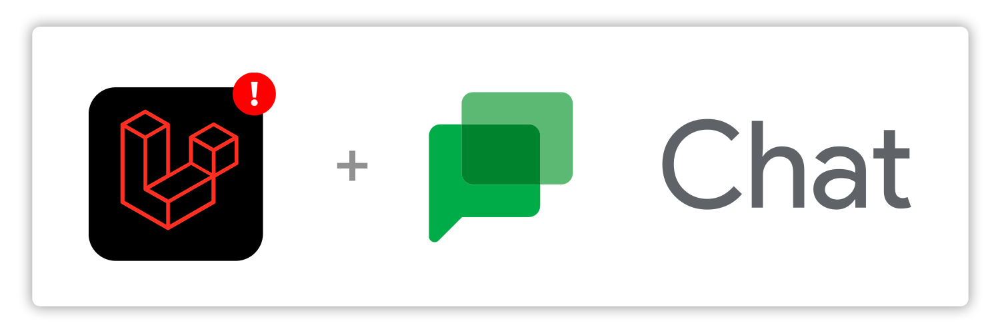

<p align="center">

</p>

[](https://packagist.org/packages/laravel-notification-channels/google-chat)
[](LICENSE.md)
[](https://github.com/laravel-notification-channels/google-chat/actions?query=workflow%3Arun-tests+branch%3Amaster)
[](https://github.com/laravel-notification-channels/google-chat/actions?query=workflow%3A"Check+%26+fix+styling"+branch%3Amaster)
[](https://packagist.org/packages/laravel-notification-channels/google-chat)

<h1>Google Chat - Laravel Notification Channel</h1>

This package makes it easy to send notifications using [Google Chat](https://developers.google.com/hangouts/chat) , (formerly known as Hangouts Chat) with Laravel 8.x

````php
class InvoicePaidNotification extends Notification
{
    // Create a super simple message
    public function toGoogleChat($notifiable)
    {
        return GoogleChatMessage::create('An invoice was paid!');
    }

    // ...Or you can use some simple formatting
    public function toGoogleChat($notifiable)
    {
        return GoogleChatMessage::create()
            ->text('Someone just paid an invoice... ')
            ->bold('Woo-hoo!')
            ->line('Looking for ')
            ->link(route('invoices'), 'the details?')
            ->to('sales_team'); // ... and route it to specific rooms
    }

    // ...You can even make a fancy card!
    public function toGoogleChat($notifiable)
    {
        return GoogleChatMessage::create()
            ->text('Invoice Paid! Here\'s the details:')
            ->card(
                Card::create(
                    Section::create(
                        KeyValue::create('Amount', '$520.99', '#10004756')
                            ->onClick(route('invoices'))
                            ->button(TextButton::create(route('invoices'), 'View'))
                    )
                )
            )
    }
}
````


## Contents

- [Installation](#installation)
	- [Generating a Webhook](#generating-a-webhook)
- [Configuring & Using Webhooks in Your Application](#configuring-&-using-webhooks-in-your-application)
	- [Default Room](#default-room)
	- [Alternate Rooms (Preferred)](#alternate-rooms-preferred)
	- [Explicit Webhook Routing](#explicit-webhook-routing)
- [Usage](#usage)
	- [Simple Messages](#simple-messages)
	- [Card Messages](#card-messages)
- [API Overview](#api-overview)
	- [Google Chat Message](#google-chat-message)
    - [Card Layout](#card-layout)
    - [Widgets](#widgets)
    - [Components](#components)
- [Changelog](#changelog)
- [Testing](#testing)
- [Security](#security)
- [Contributing](#contributing)
- [Credits](#credits)
- [License](#license)


## Installation

The Google Chat notification channel can be installed easily via Composer:

````bash
$ composer require laravel-notification-channels/google-chat
````

### Generating a Webhook

This package makes use of Google Chat's convenient 'Webhooks' feature, which allows for quick and easy setup.

You can learn how to create a room, and generate a new Webhook on [Google's documentation](https://developers.google.com/hangouts/chat/how-tos/webhooks).

> Throughout Google's own documentation, the term 'space' is used to reference conversations generally across Google Chat, whether that be a one-on-one chat between co-workers, or a 'room' with conversations between multiple people.
> 
> Although this package only has the ability to send messages into 'rooms', **we still refer to a room as a 'space' for consistency** between this package's documentation, and Google's.

## Configuring & Using Webhooks in Your Application

Firstly, let's publish the configuration file used by the Google Chat notification channel into your application, so that we can start configuring our webhooks:

````bash
$ php artisan vendor:publish --tag google-chat-config
````

### Default Room

If we only have a single room / webhook we want to post into, we can simply configure the `space` key which defines the default conversation notifications sent via the Google Chat channel will be posted to.

````php
// config/google-chat.php

return [
    'space' => 'https://chat.googleapis.com/room-webhook-for-all-notifications?key=xxxxx'
]
````

Notifications that have not otherwise been directed to another room will now be sent to this default space.

**CAUTION!** If your application sends sensitive notifications via Google Chat, we recommend you configure the `space` key to `NULL`, so that notifications must be explicitly directed to an endpoint.

### Alternate Rooms (Preferred)

You can also define alternate webhooks under the `spaces` (plural) key, and reference these more easily throughout your application:

````php
// config/google-chat.php

return [
    'spaces' => [
        'sales_team' => 'https://chat.googleapis.com/sales-team-room?key=xxxxx',
        'dev_team' => 'https://chat.googleapis.com/dev-team-room?key=xxxxx',
        'executive' => 'https://chat.googleapis.com/executives?key=xxxxx',
    ]
]
````

You can now direct notifications to one of these configured rooms by using the relevant key anywhere you can route notifications, like:

````php
Notification::route('googleChat', 'sales_team')->...

// Or

GoogleChatMessage::create()->to('dev_team')->...

// Or, even in your notifiable class:
public function routeNotificationForGoogleChat()
{
    return 'executive';
}
````

### Explicit Webhook Routing

If needed, you can route notifications to explicit webhooks in all the same places listed above. This isn't the preferred method, however, as it gives you less flexibility should you ever need to change a webhook.

````php
Notification::route('googleChat', 'https://chat.googleapis.com/xxxxx')->...

// Or

GoogleChatMessage::create()->to('https://chat.googleapis.com/xxxxx')->...

// Or, even in your notifiable class:
public function routeNotificationForGoogleChat()
{
    return 'https://chat.googleapis.com/xxxxx';
}
````

## Usage

In order to send a notification via the Google Chat channel, you'll need to specify the channel in the `via()` method of your notification:

````php
use NotificationChannels\GoogleChat\GoogleChatChannel;

// ...

public function via($notifiable)
{
    return [
        GoogleChatChannel::class
    ]
}
````

> If you haven't already, make sure you understand [how notification classes are constructed](https://laravel.com/docs/8.x/notifications).

Google Chat messages have [two formats](https://developers.google.com/hangouts/chat/reference/message-formats): Simple Messages, and Card Messages. This package allows you to construct both.

### Simple Messages

Simple messages can be created easily using a `NotificationChannels\GoogleChat\GoogleChatMessage` instance directly, and returned in your notification class like so:

````php
use NotificationChannels\GoogleChat\GoogleChatMessage;

public function toGoogleChat($notifiable)
{
    return GoogleChatMessage::create('Hello world!');
}
````

Simple messages can also contain basic formatting:

````php
use NotificationChannels\GoogleChat\GoogleChatMessage;

public function toGoogleChat($notifiable)
{
    return GoogleChatMessage::create()
        ->bold('Heads Up!')
        ->line('An error was encountered whilst communicating with an external service:')
        ->monospaceBlock($this->errorMessage)
        ->italic('Want to know more? ')
        ->link('https://status.example.com/logs', 'Check Out the Logs.');
}
````

### Card Messages

Google Chat cards are more complex pieces of UI that can display organized information to the recipient. Cards are added to a `GoogleChatMessage` instance, and can be used in combination with a simple message.

The structure of cards in this package closely resembles the actual data format sent to the webhook endpoint. For this reason, it's worth checking out [how cards are structured](https://developers.google.com/hangouts/chat/reference/message-formats/cards).

````php
use NotificationChannels\GoogleChat\GoogleChatMessage;
use NotificationChannels\GoogleChat\Card;
use NotificationChannels\GoogleChat\Section;
use NotificationChannels\GoogleChat\Widgets\KeyValue;
use NotificationChannels\GoogleChat\Enums\Icon;
use NotificationChannels\GoogleChat\Enums\ImageStyle;

public function toGoogleChat($notifiable)
{
    return GoogleChatMessage::create()
        ->text('An invoice was just paid... ')
        ->bold('Woo-hoo!')
        ->card(
            Card::create()
                ->header(
                    'Invoice Paid',
                    '#1004756',
                    'https://cdn.example.com/avatars/xxx.png',
                    ImageStyle::CIRCULAR
                )
                ->section(
                    Section::create(
                        KeyValue::create(
                            'Payment Received',
                            '$20.14',
                            'Paid by Josephine Smith'
                        )
                        ->icon(Icon::DOLLAR)
                        ->onClick(route('invoice.show'))
                    )
                )
        )
}
````

**Visual learner?** Us too. Here's a visual overview of the card structure:

````
cards
|
|---card
|   |
|   |---header (complex)
|   |   ...
|   |
|   |---sections
|   |   |
|   |   |---section
|   |   |   |
|   |   |   |---header (simple)
|   |   |   |   ...
|   |   |   |
|   |   |   |---widgets
|   |   |   |   |
|   |   |   |   |---widget
|   |   |   |   |   ...
|   |   |   |   |
|   |   |   |   |---widget
|   |   |   |   |   ...
|   |   |
|   |   |---section
|   |   |   ...
|
|---card
|   ...
````

## API Overview

### Google Chat Message

Namespace: `NotificationChannels\GoogleChat\GoogleChatMessage`

The `GoogleChatMessage` class encompasses an entire message that will be sent to the Google Chat room.

- `static create(?string $text)` Instantiates and returns a new `GoogleChatMessage` instance, optionally pre-configuring it with the provided simple text
- `to(string $space)` Specifies the webhook or space key this notification will be sent to. This takes precedence over the default space and any value returned by a notifiable's `routeNotificationForGoogleChat()` method
- `text(string $message)` Appends `$message` to the simple message content
- `line(string $message)` Appends `$message` on a new line
- `bold(string $message)` Appends bold text
- `italic(string $message)` Appends italic text
- `strikethrough(string $message)` Appends strikethorugh text
- `strike(string $message)` Alias for `strikethrough()`
- `monospace(string $message)` Appends monospace text
- `mono(string $message)` Alias for `monospace()`
- `monospaceBlock(string $message)` Appends a block of monospace text
- `link(string $link, ?string $displayText)` Appends a text link, optionally with custom display text
- `mention(string $userId)` Appends a mention text targeting a specific user id
- `mentionAll(?string $prependText, ?string $appendText)` Appends a mention-all text, optionally with text before and after the block
- `card(Card|Card[] $card)` Add one or more complex card UIs to the message

### Card Layout

The layout is split into two concepts: The card, and the section. The card can be thought of as the container, whilst the sections can be thought of as rows within the card itself. The card can have a complex, overarching header, whilst each section can contain a simple text based header.

You can add multiple sections to a card, in order to group related pieces of information.

#### Card

Namespace: `NotificationChannels\GoogleChat\Card`

The `Card` class represents the top level layout definition for a Card UI to be sent in a message. Cards define one or more sections, and may optionally define header information

- `static create(Section|Section[]|null $section)` Instantiates and returns a new `Card` instance, optionally pre-configuring it with the provided section or sections
- `header(string $title, ?string $subtitle, ?string $imageUrl, ?string $imageStyle)` Optional - Configures the header UI for the card. Note that `$imageStyle` is one of the constants defined in `NotificationChannels\GoogleChat\Enums\ImageStyle`
- `section(Section|Section[] $section)` Add one or more sections to the card

#### Section

Namespace: `NotificationChannels\GoogleChat\Section`

The `Section` class defines the intermediary layout definition of a card. From a UI perspective, it groups related widgets.

- `static create(AbstractWidget|AbstractWidget[]|null $widgets)` Instantiates and returns a new `Section` instance, optionally pre-configuring it with the provided widget or widgets
- `header(string $text)` Optionally defines the simple header displayed at the top of the section
- `widget(AbstractWidget|AbstractWidgets[] $widget)` Adds one or more widgets to the section

### Widgets

Widgets are the meaningful pieces of UI displayed throughout a single card. There are different types of widgets, in order to display information more appropriately to the user.

Widgets are added to a section, and a section can contain multiple widgets of various types.

#### Text Paragraph

Namespace: `NotificationChannels\GoogleChat\Widgets\TextParagraph`

The `TextParagraph` widget defines rich text. This widget can define more complex text formats than permissible in a simple message.

- `static create(?string $message)` Instantiates and returns a new `TextParagraph` instance, optionally pre-configuring it with the provided text
- `text(string $message)` Appends the `$message` to the widget content
- `bold(string $message)` Appends bold text
- `italic(string $message)` Appends italic text
- `underline(string $message)` Appends underline text
- `strikethrough(string $message)` Appends strikethrough text
- `strike(string $message)` Alias for `strikethrough()`
- `color(string $message, string $hex)` Appends colored text according to the `$hex` color
- `link(string $link, ?string $displayText)` Appends a textual link, optionally with the provided display text
- `break()` Appends a line break

#### Key Value

Namespace: `NotificationChannels\GoogleChat\Widgets\KeyValue`

The `KeyValue` widget defines a table like element that can segment information and provide an external click through

- `static create(?string $topLabel, ?string $content, ?string $bottomLabel)` Instantiates and returns a new `KeyValue` instance, optionally pre-configuring it with a top label, content and bottom label.
- `topLabel(string $message)` Defines the top label text
- `content(string $content)` Defines the primary text content of the widget
- `bottomLabel(string $message)` Defines the bottom label text
- `setContentMultiline(bool $value)` Determines whether the primary content should flow onto multiple lines. Google defaults this value to `false`
- `onClick(string $url)` Defines a click through URL which can be activated by clicking the widget itself. Note that this is a different definition from the button, which may optionally be added to the widget too.
- `icon(string $icon)` Defines the glyph icon displayed with the text content; One of the constants defined in `NotificationChannels\GoogleChat\Enums\Icon`
- `button(AbstractButton $button)` Optionally defines a button displayed alongside the text content

#### Image

Namespace: `NotificationChannels\GoogleChat\Widgets\Image`

The `Image` widget defines a simple image to be displayed in the card. Optionally, a click through URL can be configured for when a user clicks/taps on the image.

- `static create(?string $imageUrl, ?string $onClickUrl)` Instantiates and returns a new `Image` instance, optionally pre-configuring it with an image URL and click through URL.
- `imageUrl(string $url)` Defines the image URL where the image can be sourced
- `onClick(string $url)` Defines a URL the user will be taken to if they click/tap on the image

#### Buttons

Namespace: `NotificationChannels\GoogleChat\Widgets\Buttons`

The `Buttons` widget acts as a container for one or more buttons, laid out horizontally. This widget accepts instances of `NotificationChannels\GoogleChat\Components\Button\AbstractButton` and can accept buttons of different types.

- `static create(AbstractButton|AbstractButton[]|null $buttons)` Instantiates and returns a new `Buttons` instance, optionally pre-configuring it with the provided buttons
- `button(AbstractButton|AbstractButton[] $button)` Adds one or more buttons

### Components

Components are structures that are nestled within widgets. For simplicity, the Google Chat notification channel only supports button components.

Both the Text Button and Image Button can be nested within the `Buttons` widget, as well as in the button properties of the `KeyValue` and `ImageWidget`.

#### Text Button

Namespace: `NotificationChannels\GoogleChat\Components\Button\TextButton`

The `TextButton` defines a simple text button, and can be accepted anywhere that an `AbstractButton` is accepted.

- `static create(?string $url, ?string $displayText)` Instantiates and returns a new `TextButton` instance, optionally pre-configuring it with the provided URL and display text
- `url(string $url)` Defines the target endpoint for the button
- `text(string $text)` Defines the display text for the button

#### Image Button

Namespace: `NotificationChannels\GoogleChat\Components\Button\ImageButton`

The `ImageButton` defines a clickable icon or image, and can be accepted anywhere that an `AbstractButton` is accepted. The icon can either be a default icon (one of the constants defined in `NotificationChannels\GoogleChat\Enums\Icon`) or an external image url.

- `static create(?string $url, ?string $icon)` Instantiates and returns a new `ImageButton` instance, optionally pre-configuring it with the provided URL and icon
- `url(string $url)` Defines the target endpoint for the button
- `icon(string $icon)` Defines the icon or image to display for the button.

## Changelog

Please see [CHANGELOG](CHANGELOG.md) for more information what has changed recently.

## Testing

``` bash
$ composer test
```

The test suite also includes one end-to-end test. In order for this test to pass, a `GOOGLE_CHAT_TEST_SPACE` environment variable should be set, containing a webhook to a test room.

Alternatively, you can exclude this test with PHPUnit during local development:

````bash
$ ./vendor/bin/phpunit --exclude-group external
````

## Security

If you discover any security related issues, please email frank@thetreehouse.family instead of using the issue tracker.

## Contributing

Please see [CONTRIBUTING](CONTRIBUTING.md) for details.

## Credits

- [Frank Dixon](https://github.com/frankieeedeee)
- [All Contributors](../../contributors)

## License

The MIT License (MIT). Please see [License File](LICENSE.md) for more information.
